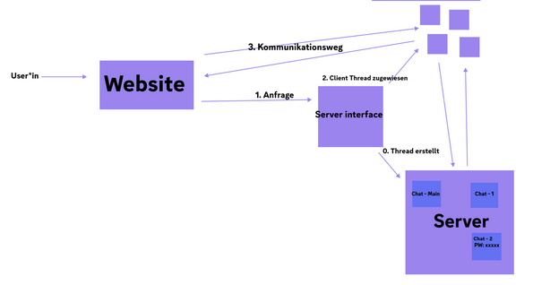

# Project Proposal

Project name:
Multi-Threaded Chat

## Description
Multi-Threaded Web Server as Chatroom: We want to create a multithreaded webserver 
hosting a chatroom for multiple clients. The chat should be accessible by a website. 
There the user can connect to different chats, some only accessible with a password.
A client can only be in one chatroom at a time (though users can open multiple tabs at a time).

## Functions Backend
* The client-server-communication works via internet. The server and clients do not have to be in the same network.
* Users of the website should be able to connect to the server, which then creates or assignes a client-thread.
* The server keeps track of created threads.
* The client thread is used for communication between a user/website and the chatroom on the server.
* Server should group messages in different chatrooms via prefix.
* The number of Clients hosted by the server should be restrictable.
* The server informs the website of all current active chats which then are displayed on the website

## Sketch Backend

## Functions Frontend
* All currently existing chats are displayed on website
* Join public chatroom 
* Join private chatroom with password
* Create new chatroom (public or private)
* Exit chat

  
## Requirements
* Publicly accessible ip for the server & website

### Ideas for extensions in case our project isn't complex enough
* Thread pool: Client-Threads get created in advance to a certain number or according to the current demand (for a dynamic thread pool). These threads can then be assigned to connecting clients.
* Host server on a Raspberry Pi or similar
* Emojis, Gifs, Sticker, Voice messages
